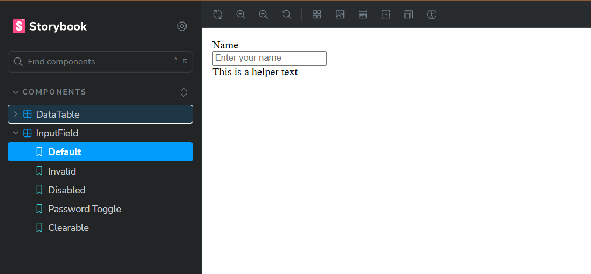
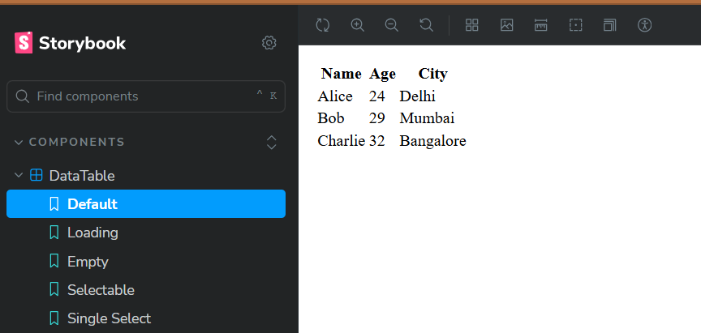

# 🚀 Frontend Component Library

A modern, accessible React component library built with Vite, TailwindCSS, and Storybook. This project demonstrates best practices in component design, documentation, and development workflow.

## 📋 Components Overview

### 🔤 InputField Component

A versatile, accessible input component with multiple variants and states.

**Features:**
- ✅ Multiple variants (outlined, filled, ghost)
- ✅ Three sizes (sm, md, lg)
- ✅ Password toggle with show/hide functionality
- ✅ Clearable input with X button
- ✅ Helper text and error message support
- ✅ Disabled and invalid states
- ✅ Responsive design with TailwindCSS
- ✅ Smooth transitions and hover effects

**Props:**
```jsx
{
  value: string,
  onChange: function,
  label?: string,
  placeholder?: string,
  helperText?: string,
  errorMessage?: string,
  disabled?: boolean,
  invalid?: boolean,
  variant?: "outlined" | "filled" | "ghost",
  size?: "sm" | "md" | "lg",
  type?: string,
  clearable?: boolean,
  passwordToggle?: boolean
}
```

**States & Variants:**
- **Variants**: Outlined (default), Filled, Ghost
- **Sizes**: Small (sm), Medium (md), Large (lg)
- **States**: Default, Focused, Invalid, Disabled
- **Special Features**: Password toggle, Clearable input

#### 📸 Screenshot



### 📊 DataTable Component

A feature-rich data table with sorting, selection, and responsive design.

**Features:**
- ✅ Sortable columns with visual indicators
- ✅ Row selection (single/multiple)
- ✅ Loading and empty states
- ✅ Responsive design with horizontal scroll
- ✅ Alternating row colors
- ✅ Hover effects and visual feedback
- ✅ Clean, modern styling

**Props:**
```jsx
{
  data: array,
  columns: array,
  loading?: boolean,
  selectable?: "single" | "multiple" | false,
  onRowSelect?: function
}
```

**Column Configuration:**
```jsx
{
  key: string,
  title: string,
  dataIndex: string,
  sortable?: boolean
}
```

#### 📸 Screenshot


## 🛠️ Tech Stack

- **Framework**: React 19.1.1 (with Vite)
- **Styling**: TailwindCSS 4.1.12
- **Documentation**: Storybook 9.1.2
- **Icons**: Lucide React
- **Testing**: Vitest + Playwright
- **Linting**: ESLint 9.33.0
- **Build Tool**: Vite 7.1.2

## 🚀 Installation & Setup

### Prerequisites
- Node.js (v18 or higher)
- npm or yarn

### 1. Clone and Install
```bash
git clone https://github.com/Iconic-017/react-component-assignment.git
cd UDS_assignment
npm install
```

### 2. Development Server
```bash
npm run dev
```
The application will be available at `http://localhost:5173`

### 3. Storybook Development
```bash
npm run storybook
```
Storybook will be available at `http://localhost:6006`

### 4. Build Storybook
```bash
npm run build-storybook
```
Creates a static build in the `storybook-static` directory

### 5. Additional Commands
```bash
npm run build          # Build for production
npm run preview        # Preview production build
npm run lint          # Run ESLint
```

## 🎯 Demo & Preview

- **GitHub Repository**: [Your Repo Link](https://github.com/Iconic-017/react-component-assignment)
- **Storybook**: [Chromatic/Vercel Deployment](https://68a188882a39175efb33e9a0-mjiqxskkva.chromatic.com/)

## 💡 Design Approach

### Component Design Philosophy
- **Reusable**: Components are designed to be flexible and reusable across different contexts
- **Scalable**: Architecture supports easy extension and modification
- **Accessible**: Built with accessibility in mind (ARIA labels, keyboard navigation, screen reader support)
- **Modern**: Utilizes latest React patterns and modern CSS practices

### Technical Decisions
- **TailwindCSS**: Chosen for rapid development, consistent design system, and easy customization
- **Storybook**: Provides comprehensive component documentation, testing, and development environment
- **Vite**: Fast build tool with excellent developer experience
- **Component Composition**: Flexible prop system allows for various use cases
- **State Management**: Local state with controlled components for predictable behavior

### Accessibility Features
- Proper label associations
- ARIA attributes where needed
- Keyboard navigation support
- Screen reader friendly
- High contrast support through TailwindCSS

## 📁 Project Structure

```
UDS_assignment/
├── .storybook/                 # Storybook configuration
│   ├── main.js                # Storybook entry point
│   ├── preview.js             # Global decorators and parameters
│   └── vitest.setup.js        # Test setup for Storybook
├── public/                    # Static assets
│   └── vite.svg
├── src/                       # Source code
│   ├── components/            # React components
│   │   ├── InputField.jsx     # Input field component
│   │   ├── InputField.stories.jsx
│   │   ├── DataTable.jsx      # Data table component
│   │   └── DataTable.stories.jsx
│   ├── App.jsx                # Main application component
│   ├── main.jsx               # Application entry point
│   └── index.css              # Global styles
├── index.html                 # HTML template
├── package.json               # Dependencies and scripts
├── vite.config.js             # Vite configuration
└── eslint.config.js           # ESLint configuration
```

## 🧪 Testing

The project includes comprehensive testing setup:
- **Vitest**: Unit and component testing
- **Playwright**: End-to-end testing
- **Storybook Addon**: Visual testing and accessibility checks
- **Coverage**: Built-in coverage reporting

## 📚 Documentation

- **Component Stories**: Each component has comprehensive Storybook stories
- **Props Documentation**: Clear prop definitions with examples
- **Interactive Examples**: Live examples in Storybook
- **Accessibility**: Built-in accessibility testing and documentation

## 🤝 Contributing

1. Fork the repository
2. Create a feature branch (`git checkout -b feature/amazing-feature`)
3. Commit your changes (`git commit -m 'Add amazing feature'`)
4. Push to the branch (`git push origin feature/amazing-feature`)
5. Open a Pull Request

## 📄 License

This project is licensed under the MIT License - see the [LICENSE](LICENSE) file for details.

---

**Built with ❤️ using React, TailwindCSS, and Storybook**